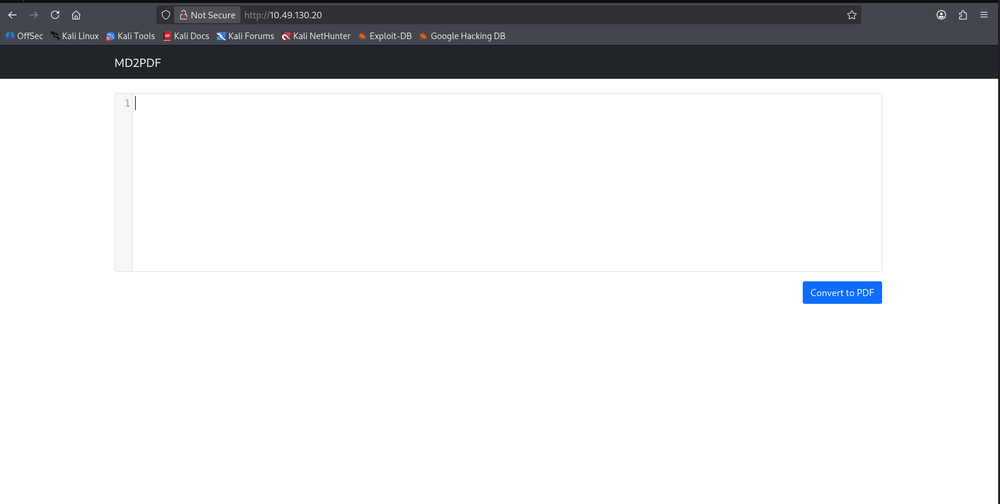
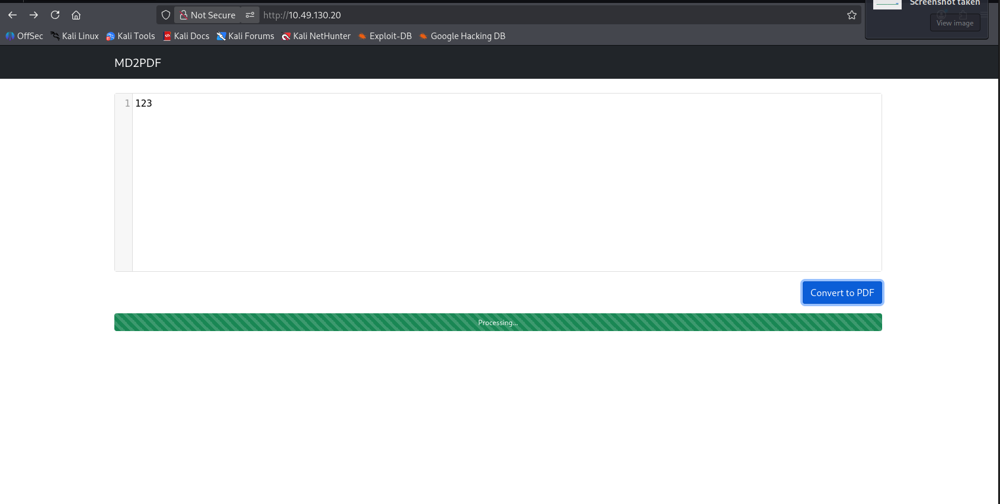
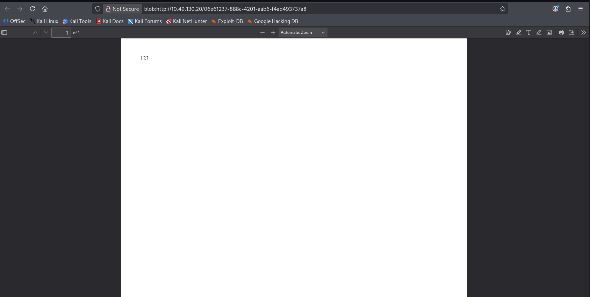
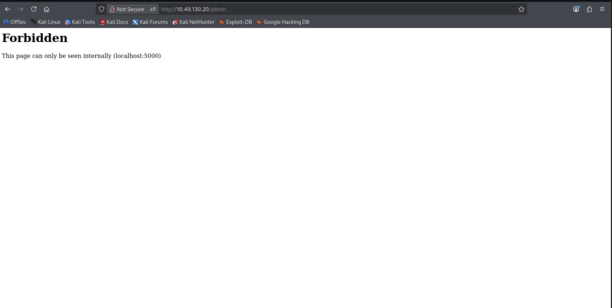
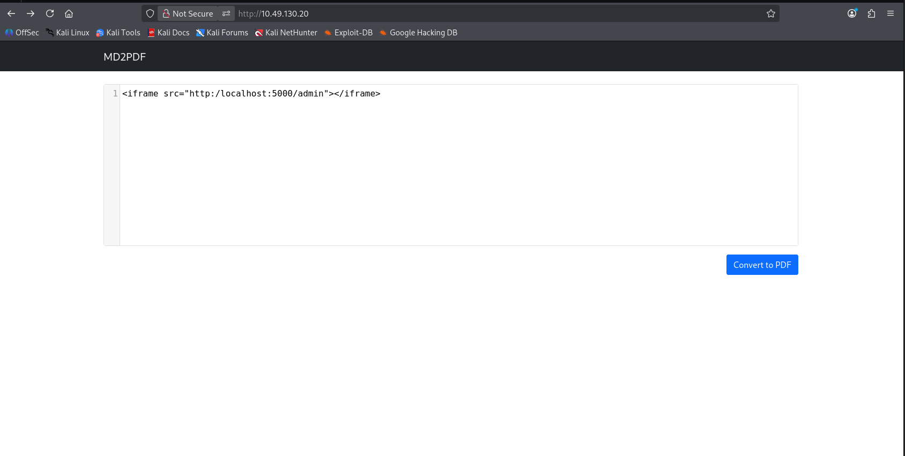
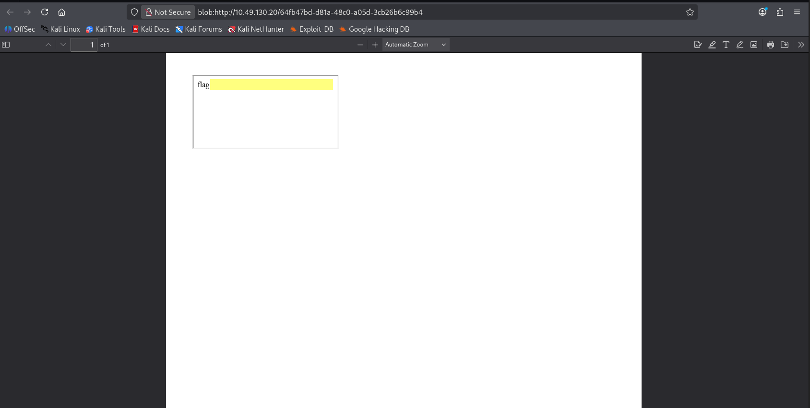

# MD2PDF

**Difficulty:** Easy  
**Category:** Web  
**Platform:** TryHackMe  
**Date:** 2026-04-12  
**Author:** Shito HENG  
**Link:** https://tryhackme.com/room/md2pdf 

## Summary

This writeup details my successful completion of TryHackMe **MD2PDF** room.

## I. Introduction

"Bypass Disable Functions" is an info room in TryHackMe platform, that simulates a web server with restricted PHP functions ('disable_function') and directory access ('open_basedir'). The objective is to upload a malicious PHP file, bypass these restrictions, and execute a reverse shell.

## II. Methodology

### 1. Planning & Scoping

**Target (Host):** 10.49.130.20   
**Provided Files/Attachments:** N/A  
**Scopes/Allow Actions:** Testing limited to the TryHackMe lab environment. Actions follow platform rules (no brute force against external hosts; no exfiltration of real data).  
**Rules of Engagement (ROE):**
- Test only the provided machine / resources
- Do not publish flags or sensitive data

**Objective:**
- Identify vulnerabilities in web server
- Bypass file upload restriction to upload the php backdoor file
- Execute reverse shell to gain access to the server
- Locate the file 'flag.txt'

### 2. Scanning

**Tool:** Nmap  
**Usage:** Active network scanner — discover hosts, open ports, services, versions, run NSE scripts for common checks.  
**Command**
```bash
nmap -p- -Pn -sC -sV 10.49.130.20 --min-rate=10000
```
**Result**
```text
Nmap scan report for 10.49.130.20
Host is up (0.23s latency).
Not shown: 63409 filtered tcp ports (no-response), 2124 closed tcp ports (reset)
PORT   STATE SERVICE    VERSION
22/tcp open  tcpwrapped
|_ssh-hostkey: ERROR: Script execution failed (use -d to debug)
80/tcp open  tcpwrapped                                                                                                                                                                                        
                                                                                                                                                                                                               
Service detection performed. Please report any incorrect results at https://nmap.org/submit/ .                                                                                                                 
Nmap done: 1 IP address (1 host up) scanned in 61.90 seconds 
```
Based on the result above, port 22 (ssh) and 80 (http) are open, which we could plan our further attack method

**Tool:** Gobuster  
**Usage:** Web content discovery — brute‑force directories and file names on web servers.  
**Command**
```
gobuster dir -u http://10.49.130.20 -w /usr/share/seclists/Discovery/Web-Content/big.txt -t 100
```
**Result**
```
===============================================================
Gobuster v3.8.2
by OJ Reeves (@TheColonial) & Christian Mehlmauer (@firefart)
===============================================================
[+] Url:                     http://10.49.130.20
[+] Method:                  GET
[+] Threads:                 100
[+] Wordlist:                /usr/share/seclists/Discovery/Web-Content/big.txt
[+] Negative Status codes:   404
[+] User Agent:              gobuster/3.8.2
[+] Timeout:                 10s
===============================================================
Starting gobuster in directory enumeration mode
===============================================================
admin                (Status: 403) [Size: 166]
convert              (Status: 405) [Size: 178]
Progress: 20481 / 20481 (100.00%)
===============================================================
Finished
===============================================================
```
From this output, we see that no directory could be accessable for the web server.

### 3. Vulnerability Analysis

Next, we open the web server to see if there're any path that we could exploit.



We see that it shows the typing box for us to write something, and then convert it to pdf.



As we see here, it shows the submission for file in cv.php





### 4. Exploitation

In this room, we are recommend to use **Chankro** to exploit the web server





## III. Challenges Faced

## IV. Lesson Learned

## V. Remediation

## VI. References
